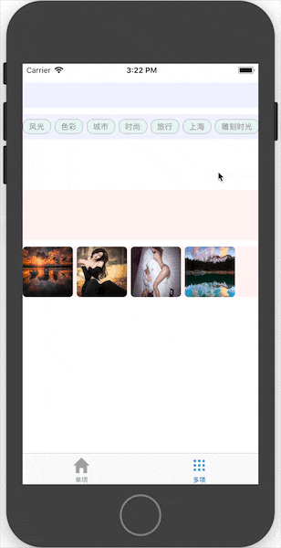

Interactive
---
用于两个视图之间做子视图的互动关联
  
  


### Usage
``Interactive``需要依赖[FlexView](https://github.com/gavinning/FlexView)  
其诸多特性需要``FlexView``支持，例如子视图进出场动画，自动滚动区域等等
```swift
// 需要实现两个代理方法
// @1 创建父视图的方法
func createParent() -> FlexView
// @2 创建子视图队列的方法
func createItems() -> [UIView]
```

#### 单例模式
```swift
import UIKit

class ViewController: Interactive {
    
    var marginSide: CGFloat = 10
    var margin: CGFloat {
        return marginSide*2
    }

    override func viewDidLoad() {
        super.viewDidLoad()
        
        // 返回两个父视图
        // inter.a & inter.b
        // 可以根据需要添加到ViewController中
        inter.b.frame.origin.y = inter.a.frame.origin.y + inter.a.frame.height + 10
        self.view.addSubview(inter.a)
        self.view.addSubview(inter.b)
    }

    override func didReceiveMemoryWarning() {
        super.didReceiveMemoryWarning()
    }

    // 创建父视图的方法
    override func createParent() -> FlexView {
        let bar = FlexView(frame: CGRect(x: 0, y: 30, width: self.view.frame.width, height: 40))
        bar.axis = .horizontal
        bar.spacing = 6
        bar.showsHorizontalScrollIndicator = false
        bar.showsVerticalScrollIndicator = false
        bar.contentInset = UIEdgeInsets(top: 8, left: 0, bottom: 8, right: 0)
        bar.backgroundColor = UIColor(red: 0, green: 0, blue: 1, alpha: 0.05)
        bar.contentSizeToFit()
        return bar
    }

    // 创建子视图队列的方法
    override func createItems() -> [UIView] {
        let tags = ["风光", "色彩", "城市", "时尚", "旅行", "上海", "雕刻时光", "手绘", "插画"] // , "CG", "原画", "35mm", "尼康"

        return tags.map { (tag) in
            let btn = UIButton()
            btn.setTitle(tag, for: .normal)
            btn.setTitleColor(.gray, for: .normal)
            btn.titleLabel?.font = UIFont.systemFont(ofSize: 12)
            btn.layer.masksToBounds = true
            btn.layer.cornerRadius = 10
            btn.layer.borderColor = UIColor.gray.cgColor
            btn.layer.borderWidth = 0.5
            btn.contentEdgeInsets = UIEdgeInsets(top: 4, left: self.marginSide, bottom: 4, right: self.marginSide)
            btn.sizeToFit()
            btn.backgroundColor = UIColor(red: 0, green: 1, blue: 0, alpha: 0.05)
            btn.addTarget(self, action: #selector(itemClicked(_:)), for: .touchUpInside)
            return btn
        }
    }    
}
```

#### 多实例模式
```swift
import UIKit

class MoreViewController: UIViewController {
 
    override func viewDidLoad() {
        super.viewDidLoad()
        
        // TagInteractive是Interactive的子类
        // 子类具体实现可以参考单例模式
        let tag = TagInteractive()
        tag.viewDidLoad()
        tag.inter.b.frame.origin.y = tag.inter.a.frame.origin.y + tag.inter.a.frame.height + 10
        self.view.addSubview(tag.inter.a)
        self.view.addSubview(tag.inter.b)
        
        // ImageInteractive是Interactive的子类
        let image = ImageInteractive()
        image.viewDidLoad()
        image.inter.b.frame.origin.y = image.inter.a.frame.origin.y + image.inter.a.frame.height + 10
        self.view.addSubview(image.inter.a)
        self.view.addSubview(image.inter.b)
    }
    
    override func didReceiveMemoryWarning() {
        super.didReceiveMemoryWarning()
    }
}
```